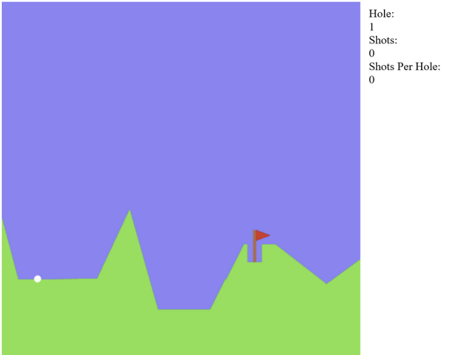
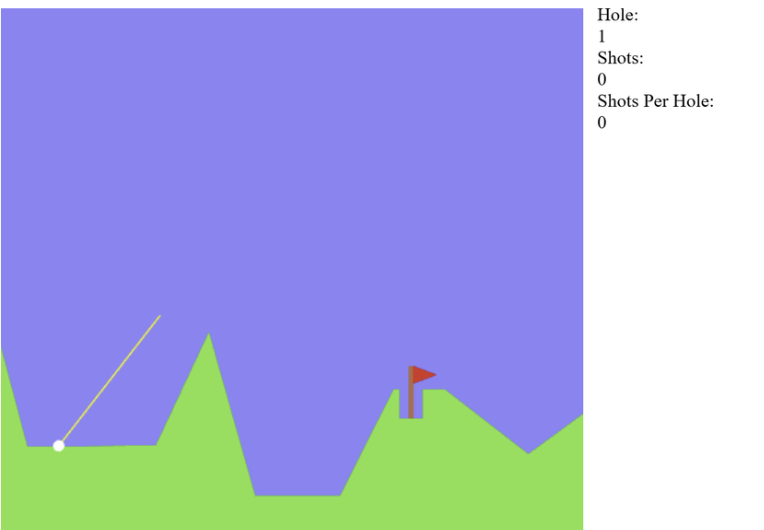

# Un juego de golf en JavaScript

Este es un sencillo juego de golf desarrollado en JavaScript con las siguientes características:
- **Cargar el juego**: `game.html` para ejecutar el juego.
- **Instrucciones**: Usa el ratón para disparar cuando la bola está inmóvil.
- **Compatibilidad**: Actualmente no compatible con dispositivos táctiles.
- **Niveles**: Presenta hoyos/niveles infinitos.
- **Dependencias**: Utiliza Ramda y RequireJS (incluidos).
- **Funcionamiento**:

  
  

## Autores
- **Oskar Kvist**: Creador y desarrollador original.

## Coautores
- **Sebastian Beller, Susan Cespedes, Wilner Mena**: Coautor(es), responsable(s) de realizar el análisis estático del código con SonarQube, corregir errores y mejorar la calidad y mantenibilidad del código.

## Contribuciones
- **Análisis Estático con SonarQube**: Se realizó un análisis estático exhaustivo utilizando SonarQube. Este análisis identificó varios problemas relacionados con la **fiabilidad**, **mantenibilidad** y **seguridad** del código.
- **Corrección de errores e implementaciones**:
    - **Fiabilidad**: Se abordaron problemas que podían causar comportamientos inesperados o fallos, mejorando la robustez del código.
    - **Mantenibilidad**: Se refactorizaron partes del código para mejorar su legibilidad y facilitar su mantenimiento futuro.
    - **Seguridad**: Se identificaron y solucionaron puntos críticos de acceso de seguridad, asegurando un manejo más seguro de las entradas del usuario y reduciendo posibles vulnerabilidades.

Estas mejoras resultaron en un código más estable, seguro y fácil de mantener.

## Licencia
Este proyecto está licenciado bajo la Licencia Pública General GNU, versión 3 (GPLv3).

Copyright (C) 2020 Oskar Kvist

Este programa es software libre: puedes redistribuirlo y/o modificarlo bajo los términos de la Licencia Pública General de GNU según lo publicado por la Free Software Foundation, ya sea la versión 3 de la licencia o (a tu elección) cualquier versión posterior.

Este programa se distribuye con la esperanza de que sea útil, pero **SIN NINGUNA GARANTÍA**; ni siquiera la garantía implícita de **COMERCIABILIDAD** o **IDONEIDAD PARA UN PROPÓSITO PARTICULAR**. Consulta la Licencia Pública General de GNU para más detalles.

Debes haber recibido una copia de la Licencia Pública General de GNU junto con este programa. Si no es así, consulta [https://www.gnu.org/licenses/](https://www.gnu.org/licenses/).
